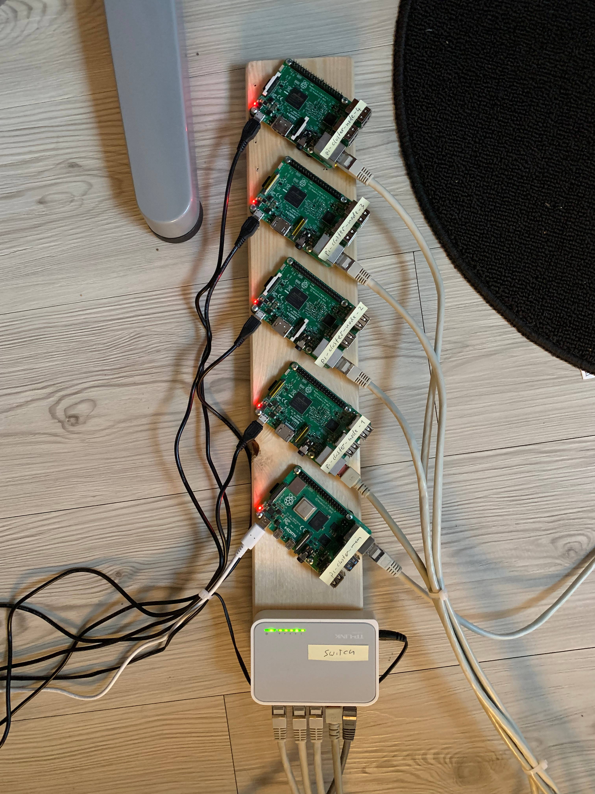
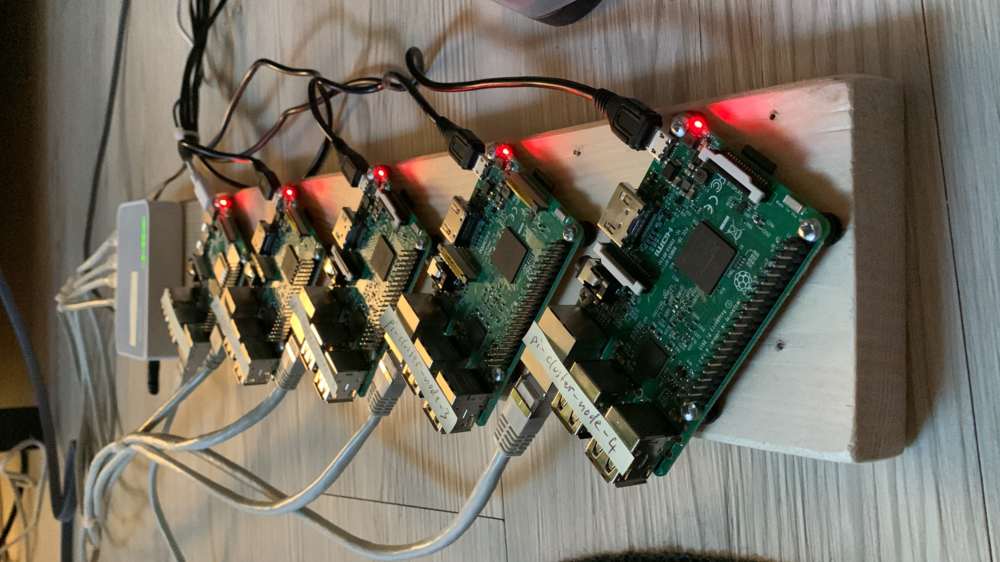

# raspberry-pi-cluster

👾 An educational project building a cluster out of Raspberry Pi's.

## Structure

The project is made of the following components:

- 1 [Raspberry Pi](https://www.raspberrypi.org/) 4 Model B serving as the cluster manager and gateway to the outside of the network
- 4 [Raspberry Pi](https://www.raspberrypi.org/) 3 Model B serving as the worker nodes doing the actual request handling
- [Docker](https://www.docker.com/) for easy application management
- [Portainer](https://www.portainer.io/) as a graphical management solution for Docker
- [A fork of Mozilla Send](https://github.com/timvisee/send) as the clustered application
- [Samba](https://www.samba.org/) for centralized network storage
- [Nginx](https://www.nginx.com/) as reverse proxy & load balancer
- [NoIP](https://www.noip.com/de-DE) as a dynamic DNS solution
- [Let's Encrypt](https://letsencrypt.org/) for free HTTPS certificates

## Files & Directories

### `certs/` directory

Contains utilities for creating a self-signed CA & SAN certificate used for securing traffic inside the network. This is primarily required for Docker.

### `filesharing/` directory

Contains a `docker-compose.yml` file and various configuration for running the Send application.

### `pictures/` directory

Serves some pictures for showcasing purposes.

### `registry` directory

Contains a `docker-compose.yml` as well as configuration files used to run a private Docker registry.

### `storage/` directory

Contains a `docker-compose.yml` as well as configuration & some utilities to setup network storage using Samba.

### `portainer.yml` file

Used to deploy Portainer across the cluster.

### `shutdown.sh` file

A utility script used to gracefully shutdown all nodes in the cluster.

## Build your own!

TODO

## 💐 Showcase

Below you can find pictures of the physical setup used for this project.

The Raspberry Pi's as well as the switch are mounted securely on a wooden board with separators made out of plastic. We're aware that this can be a security issue in terms of fire protection, but the cluster only ran under supervision 🤓.

### Top view

### Front view

